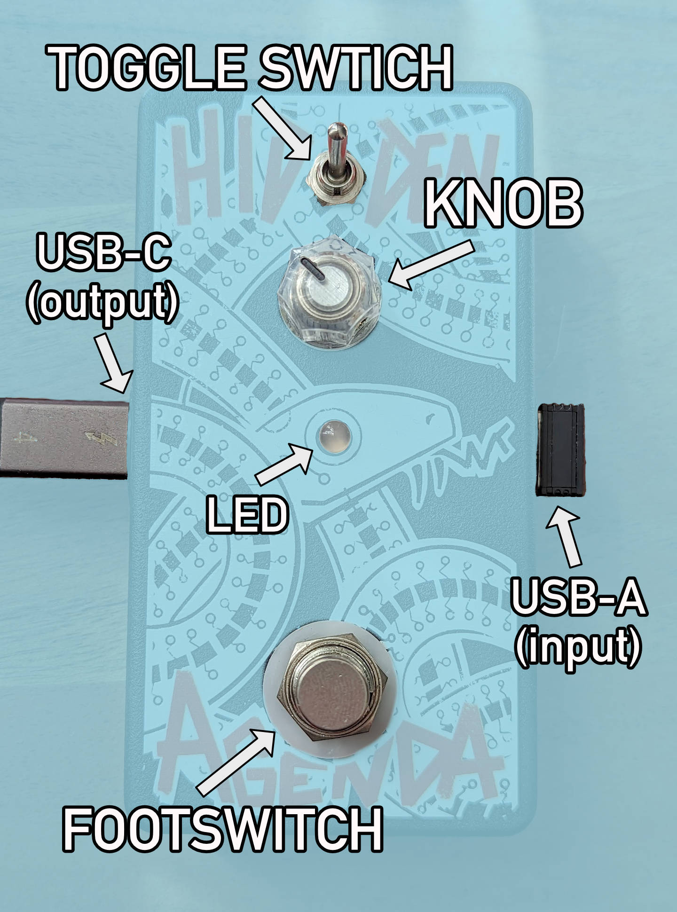

# Hidden Agenda Usage
**Safety note: This is a DIY project, use at your own risk! Do not plug anything other than a USB keyboard or mouse into the USB-A port. Do not use the USB-A port to charge your devices.**

## Quick Start
1. Plug the Hidden Agenda into your computer using the USB-C port on the left side of the pedal.
2. Plug your USB mouse or keyboard (or USB dongle for wireless mice/keyboards) into the USB-A port on the right side of the pedal.
3. Flip the toggle switch into the middle position to enter `FX Select` mode. The LED should start blinking.
4. Turn the knob to select your effect - the LED's color will indicate which of the four you have selected.
5. Flip the toggle switch into the "down" position to enter `Latch` mode. The LED should turn off.
6. Hit the footswitch to engage the effect! Your mouse/keyboard should be processed by the effect, and the LED should be providing visual feedback.
7. Dial the knob the change the parameters of the effect, if desired.
8. Hit the footswitch again to disable the effect.

The order of [effects](../../README.md#what-effects-does-it-have) (from knob all-the-way left -> all-the-way right) are:
* Mouse
  1. Looper
  2. Reverb
  3. Distortion/Filter
  4. Crossover
* Keyboard
  1. Delay
  2. Tremolo
  3. Pitch Shift / Harmonizer
  4. Crossover

 

## More Usage Details
### `Toggle Switch (Mode Select)`
The toggle switch is used to choose between the 3 modes of operation:

#### 1. `Momentary` mode (switch is flipped up)
In this mode, the currently selected effect will only be active _while_ the user is holding down the footswitch. While the footswitch is not pressed, all USB HID events will be passed through to the connected computer, untouched.

#### 2. `FX Select` mode (switch is in middle position)
In this mode, the user can use the knob to change the currently selected effect. The LED will be blinking, and the color represents which FX slot is currently selected. The knob is divided into 4 zones, one for each possible FX slot. In this mode, all USB HID events will be passed through to the computer, untouched.

#### 3. `Latch` mode (switch is in flipped down, towards the knob)
In this mode, the currently selected effect will be _toggled_ on and off by the footswtich. When the user presses the footswitch for the first time, the effect will engage and remain active. When the user presses the footswitch again (following a full release), the effect will disengage and remain inactive until the user presses the footswtich again. While the effect is inactive, all USB HID events will be passed through to the connected computer, untouched.

### `LED`
The RGB LED indicator behaves differently depending on which mode the pedal is in (see above). In `FX Select mode`, it will flash a color slowly to indicate which effect is currently selected. The knob is virtually divided into 4 (roughly) equally sized zones - 1 for each of the FX slots. The default colors for each FX slot 1-4 (from knob all-the-way left -> all-the-way right) are:
1.  `Orange-ish`
2.  `Purple-ish`
3.  `Green-ish-blue-ish`
4.  `Pink-ish`

**(Note that colors on your computer/phone screen will look slightly different than on the RGB LED)**

While the pedal is in either `Latch` or `Momentary` modes, the LED will show you which effect is currently selected (using the colors above), whether or not the effect is engaged, and a rough indication of what the effect is _doing_ (and/or how it is configured) using patterns of blinking and fading.

In an effort to try to make the device more accessible/less annoying, many of the LEDs properties are configurable. See the [serial console](#the-serial-console) section below. You can:
* Change any/all of the colors associated with the FX slots.
* Change the overall brightness of the LED (this will affect color accuracy).
* Disable all blinking/fading/patterns (the LED will either be on or off depending on state).

### `Boot Button (update/modify the firmware)`
If you want to update the pedal's firmware, upload your own, or explore alternative usages ([such as using it as a MIDI Controller!](../../circuitpython/midi_controller/)), you'll need to use the `boot` button. This button places the pedal into UF2 bootloader mode, which means you can drag and drop a `.uf2` firmware file compiled for the [RP2040 microcontroller](https://en.wikipedia.org/wiki/RP2040) onto it via USB. To find the latest "official" firmware, check out the [releases](https://github.com/dupontgu/hidden_agenda_pedal/releases) page of this repository. To load the firmware:

1. Plug the pedal into your computer using the USB-C port.
2. Flip the pedal over and unscrew/remove the bottom panel.
3. Press the "boot" button on the bottom of the circuit board inside the pedal.
4. Observe that a new disk drive has mounted to your computer, likely called: `RPI-RP2`.
5. Drag and drop your new `.uf2` file onto the drive. When it's done uploading, the pedal will restart with the new firmware running.

#### Additional Notes (Advanced)
* If you want to build your own custom firmware, check out the [hardware docs](../../hardware/) to figure out which pins are being used for what.
* If you don't want to take the back cover off, you can use the [seraial console's boot command](#boot) to programmatically place the pedal into bootloader mode.
* **The `boot` button is NOT hardwared to the RP2040's `BOOTSEL` pin! It is hooked up to a GPIO pin and resetting the RP2040 using a [software call](../../firmware/src/hidden_agenda.cpp#L233)! If you do write custom firmware, you will have to manually copy this functionality.**
* In case you forget to handle ^^, there is a hardwired `BOOTSEL` button on the _top_ of the circuit board. It is on the XIAO module, labeled: `B`. Hold it while power-cycling the board to enter bootloader mode.

## The Serial Console
In addition to acting as a USB keyboard/house, the Hidden Agenda can act as a USB serial device. You can connect to the serial console using a terminal application on your computer. While connected, the pedal will emit log messages and can receive commands to change certain settings. 

If you don't know how to "talk" to a USB serial device, I highly recommend Adafruit's tutorials for [Windows](https://learn.adafruit.com/welcome-to-circuitpython/advanced-serial-console-on-windows), [macOS](https://learn.adafruit.com/welcome-to-circuitpython/advanced-serial-console-on-mac-and-linux), and [Linux](https://learn.adafruit.com/welcome-to-circuitpython/advanced-serial-console-on-linux). Ensure that your pedal is plugged into your computer using the USB-C port before attempting to connect!

All supported commands are documented below. Each command is sent to the device by first typing `cmd:`, then the name of the setting you are trying to change, then the value(s) you'd like to set, then hitting enter. The items should be separated by colons.

### `boot`
* Resets the device into USB bootloader mode so you can update/change the firmware.
* (No parameters)
* example: `cmd:boot`

### `reset`
* Sets all following settings to their default hardcoded values
* (No parameters)
* example: `cmd:reset`

### `brightness`
* Sets the maximum brightness of the onboard LED, as a percentage
* parameter: an integer between 1-100 (inclusive) representing the brightness percentage
* defaults to 70%
* example: `cmd:brightness:80` (sets the maximum brightness to 80%)

### `flash`
* Sets whether or not the onboard LED should blink/flash/change brightness while in use, or remain static.
* parameter: either `on` or `off`
* defaults to `on`
* example: `cmd:flash:off` (sets the maximum brightness to 80%)

### `set_color`
* Sets the LED color for a given FX slot.
* parameter 1: index of the FX slot you want to change the color of (1-4)
* parameter 2: 24-bit [hex RGB color](https://htmlcolorcodes.com/)
* default values are: `{0xFF4000, 0x4000FF, 0x00FF40, 0xAA0070}`
* example: `cmd:set_color:1:FF0000` (sets the the color for the first FX slot to red)

### `raw_hid`
* Sets whether or not the pedal should log all _incoming_ HID messages from connected keyboards/mice (as hex strings).
* parameter: either `on` or `off`
* defaults to `off`
* example: `cmd:raw_hid:on` (turns on HID logging - all incoming HID messages will be printed to the serial console)

