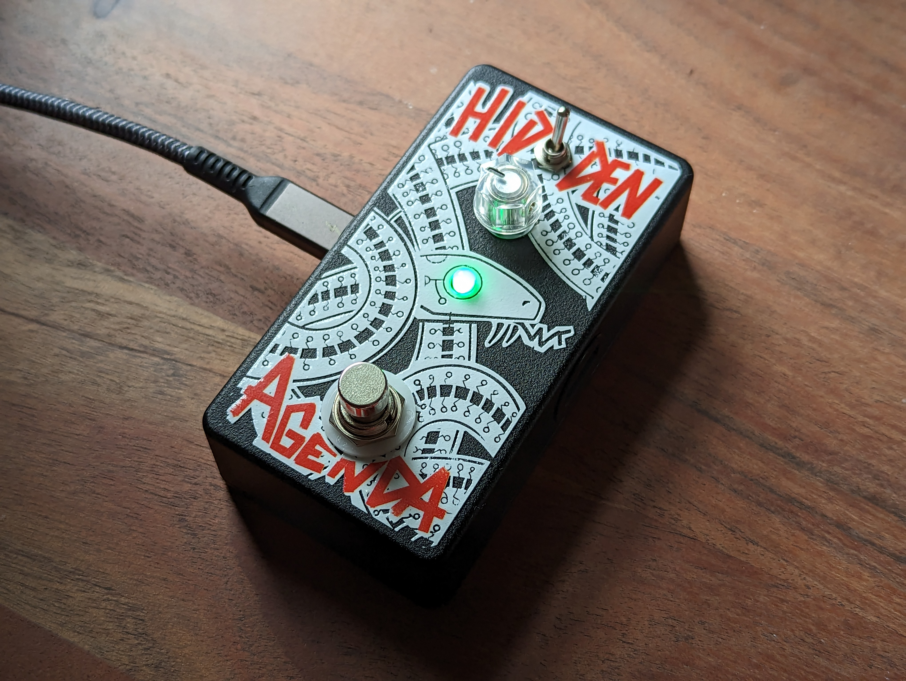

# Hidden Agenda
 **A multi-effects pedal for your mouse and keyboard!**

 Have you ever wanted to add reverb to your mouse cursor and sending sailing gently accross your screen? Have you ever wished you could emphatically stomp on something to engage caps lock before ripping an angry email to your manager or tweeting at an airline? No? Well, I made this anyways.

 ## Contents
 * [How it works](#how-it-works) (at a high level)
 * [Full usage instructions](.docs/usage/)
 * [FAQ](.docs/faq/)
 * [Firmware Source Code](firmware/) (and build instructions)
 * [Electronics](hardware/) (schematic/board files)
 * [Enclosure](enclosure/) (CAD/Art)
 * [Alternate Usages](./circuitpython/) (use it as a MIDI controller!!)

 

 ### Shout-outs
 * Pedal artwork by [Ted Pioli](https://www.tedp.io/)
 * Pedal fabrication from [AmplifyFUN](https://amplifyfun.com/)

 ## How It Works

 The Hidden Agenda works as an HID interceptor. You plug your mouse/keyboard directly into the pedal, and then you plug the pedal into your computer via USB. The software on the pedal analyzes the data coming from the keyboard/mouse, applies some "signal processing" to it, and then forwards the processed data to the computer. When the pedal is off, it simply passes the keyboard/mouse data through without modifying it. It is a standalone unit and should not require any additional software to be installed on your computer - as far as it's concerned, the pedal is just a run-of-the-mill USB keyboard/mouse combo.

 ## What Effects Does It Have?

 The Hidden Agenda currently has 4 unique effects for mouse, and 4 for keyboard. They are mostly inspired by classic audio effects that you might find in a "real" pedal. Each effect has one parameter that can be tweaked with the onboard knob.

 ### Mouse Effects
 #### `1. Reverb`
 Send your cursor flying! This effect adds a bit of momentum to your mouse cursor, so when you stop moving your hand, it will keep going in the direction you were heading. When this effect is active, the knob controls the "length" of the reverb (or, how long it will take to slow down to a stop after you've stopped moving).

 #### `2. Distortion / Noise Filter`
 This is a two-in-one effect. Turn _up_ the knob (past halfway), and the pedal will add an increasing amount of random noise to your path of motion. Turn _down_ the knob, and the pedal will apply a low-pass filter to your motion, effectively smoothing it out. 

 #### `3. Looper`
 Record a gesture with your mouse and play it back on a loop. Hold the right mouse button down to record, move around as you please, and watch loop playback begin as soon as you release. Use the knob to adjust the playback speed of the loop. Turn it all the way up to play it at 2.5X speed, turn it all the way down to play at -2.5X (reversed!).

 #### `4. (Bonus) Crossover`
 Use your mouse as a keyboard! Move up/down to choose a character, left click to "type" it and move to the next.

 ### Keyboard Effects
 #### `1. Tremolo`
 Change the "volume" of your typing on a time interval. Imagine an imaginary hand pressing and releasing the shift key for you on a fixed schedule. Turn the knob up to increase the switch rate between upper/lowercase. If you turn the knob _all_ the way up, the effect will constanly force your typing to uppercase, effectively turning the pedal into a foot-powered caps lock button. If you turn the knob all the way down, the pedal will apply rANdOm/SarCaStiC case as you type.

 #### `2. Delay`
 Echo! (echo... echo...). This effect will repeat keystrokes on a time interval for you while it is engaged. Turn the knob up to increase both the number of repetitions and time between repetitions.

 #### `3. Pitch Shift / Harmonizer`
 Maps your keystrokes to... different keystrokes. The knob is divided into 3 sections. In the lowest section, the pedal will simply replace the keys you're pressing with those which are a fixed _"distance"_ away (by their [ascii number](https://www.asciitable.com/)). So if the distance is set to 1, and you press the 'a' key, the pedal will instead type 'b'. If the distance is set to 2, pressing 'a' would yield 'c', etc. You can increase the distance between characters by turning the knob up. As soon as you turn the knob into the second section (about 10 o'clock), the behavior changes slightly. Now, instead of a "pitch shift", this becomes a "harmony" - the orignal key you pressed will be typed, _as well as_ the shifted one. In other words, pressing one key will yield two typed characters. If you turn the knob into the third section (about 2 o'clock), the pedal will type 3 characters for each key you press: your original key character, one that is `n` characters away from that one, and another that is `n` characters away from the second. Think of it as a chord! You can turn up the knob _within_ each section to increase `n`.

 #### `4. (Bonus) Crossover`
 Use your keyboard as a mouse! The arrow keys move the cursor as you'd expect. The `enter` key emulates the mouse's left button. Use the letter keys to send the cursor flying in random directions. Yes, seriously. Modifier keys work as usual.