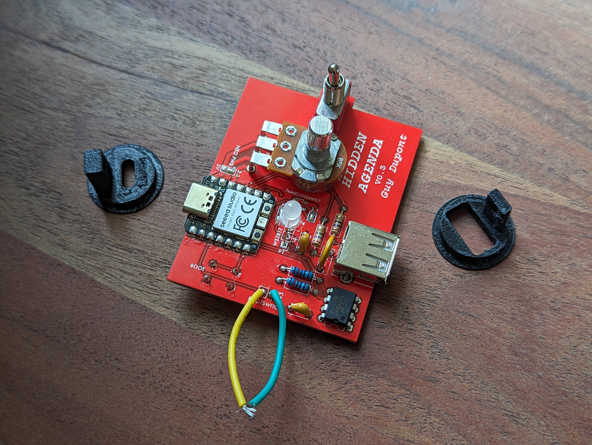
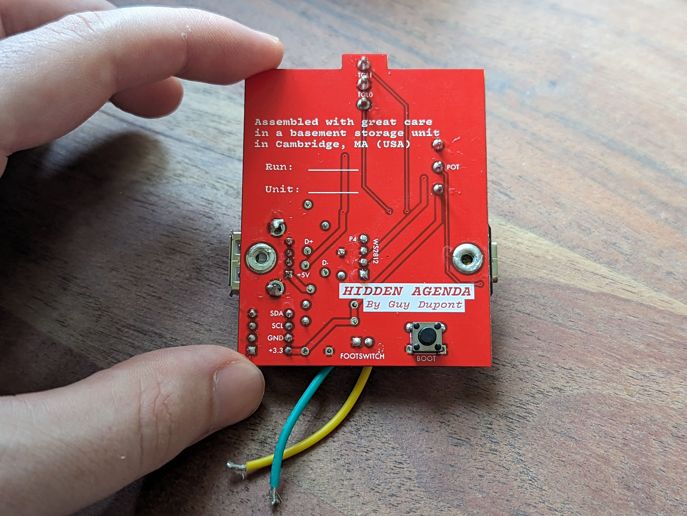

# Hidden Agenda Hardware

Check out an interactive version of this KiCAD project using [KiCanvas](//TODO)!!

## BOM

_Most_ of the BOM is available in a [DigiKey parts list](https://www.digikey.com/en/mylists/list/27DUQKO28G), but please read the following notes:
* I have been purchasing the [potentiometer](https://guitarpedalparts.com/products/b5k-16mm-potentiometer-round-shaft-right-angle-pcb-pins), 
[SPDT toggle switch](https://guitarpedalparts.com/products/spdt-on-off-on-toggle-switch-solder-lugs), 
[footswitch](https://guitarpedalparts.com/products/momentary-spdt-foot-switch), and 
[knob cap](https://guitarpedalparts.com/products/small-fluted-knob-clear) on [GuitarPedalParts.com](https://guitarpedalparts.com/)
* For the LED, I use the [WS2812D-F5](https://datasheet.lcsc.com/lcsc/2204181500_Worldsemi-WS2812D-F5_C190565.pdf), which runs on 3.3V power and logic. These are easily sourced on eBay/AliExpress.

## Assembly Notes

* All components are through-hole except for the XIAO RP2040 module.
* The boot button should be installed on the _bottom_ of the board.
* The threaded inserts should also be inserted and soldered from the bottom of the board. For safety, I have been taping over the holes on the top side as well.

 
 

## Schematic

 